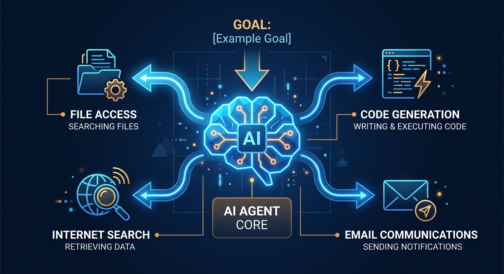
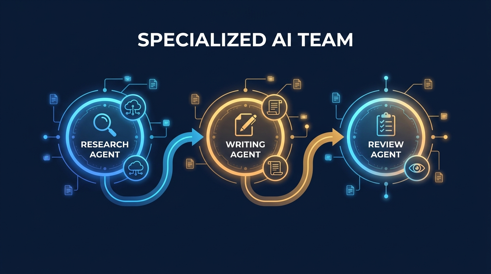
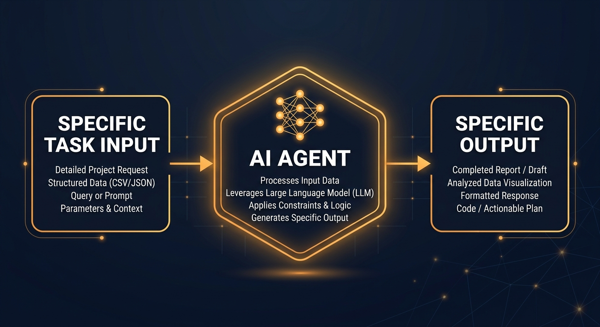

# סוכני AI: הכלי שמשנה את אופן העבודה שלך עכשיו

בינה מלאכותית כבר לא עונה רק על שאלות — היא פועלת. אם עדיין לא עבדת עם סוכן AI, זה הזמן להכיר.

---

## מה זה סוכן AI?

סוכן AI הוא תוכנה שמקבלת החלטות ומבצעת פעולות בלי שתצטרך לנחות אותה צעד אחר צעד. הוא קורא קבצים, כותב קוד, גולש באינטרנט ושולח מיילים — הכל לשם מטרה אחת שהגדרת לו. בניגוד לצ'אטבוט שעונה ומחכה, הסוכן ממשיך לפעול עד שהמשימה הושלמת.

*סוכן AI פועל כמו עובד עצמאי: מקבל מטרה, בוחר כלים, ומשלים את המשימה*

---

## למה זה משנה לך?

עד לאחרונה, כלי AI ייצרו טקסט. עכשיו הם מבצעים עבודה. חברות שכבר אימצו סוכנים מדווחות על חיסכון של עשרות שעות בשבוע. מי שיודע לעבוד עם סוכני AI — מקבל יתרון אמיתי בשוק העבודה של היום.

---

## שלושה סוגי סוכנים שכדאי להכיר

**סוכני ביצוע** מטפלים במשימות חוזרות: ניתוח דוחות, מענה לפניות לקוחות, ניהול לוחות זמנים. הם עושים את אותה עבודה שוב ושוב — בלי עייפות ובלי טעויות.

**סוכני תכנון** מקבלים מטרה גדולה ומחלקים אותה לצעדים. הם לא רק מבצעים — הם גם מחליטים מה הסדר הנכון לעשות.

**מערכות רב-סוכן** מפעילות מספר סוכנים במקביל. סוכן חוקר, סוכן שני כותב, סוכן שלישי בודק. כל אחד מתמחה בתפקיד שלו — בדיוק כמו צוות אנשים.

*מערכת רב-סוכן: כל סוכן מתמחה, כולם עובדים יחד לקראת מטרה אחת*

---

## איך מתחילים — נכון

הטעות הנפוצה היא להגדיר משימה מטושטשת. "תעזור לי בעבודה" — זה לא עובד. "סכם לי כל בוקר את חמש הכתבות החשובות מהתחום שלי" — זה עובד. ככל שהמשימה ממוקדת יותר, כך התוצאה טובה יותר. התחל בבעיה קטנה אחת, למד מהתוצאה, הרחב משם.

*הדרך הנכונה: משימה ספציפית נותנת תוצאה ספציפית*

---

## לסיכום

סוכני AI כבר פועלים בחברות מתחרות שלך. הם משנים תהליכי עבודה, חוסכים זמן ומפנים אנשים לעבודה שדורשת חשיבה אמיתית. הצעד הראשון פשוט: בחר משימה אחת חוזרת ונשנית, הגדר אותה בצורה ברורה, ותן לסוכן לעבוד.
